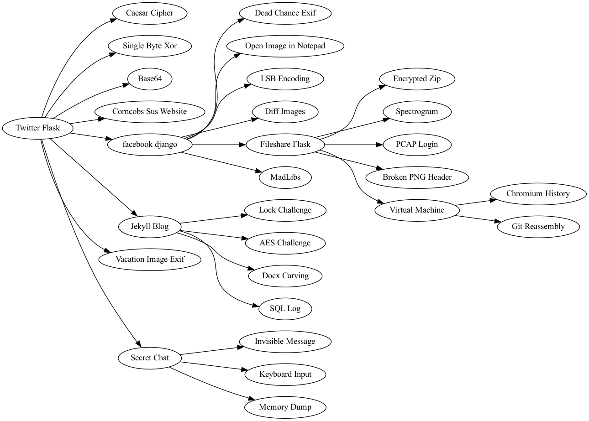

# MCPS HSF 2023

## Summary
This competition took place on March 14th, 2023 and had over 200 competitors. The competition was a CTF style competition with 28 flags to be found. The mystery in this competition was Chance's murder, and students had to use their forensics and cyber skills to catch them. Overall, the competition was a success and the players had a lot of fun, even if there were some performance issues and bugs. 

## Writeup
[Competition Writeup](https://justluk.dev/posts/writeups/mcpshsf/)

## Challenge Graph

